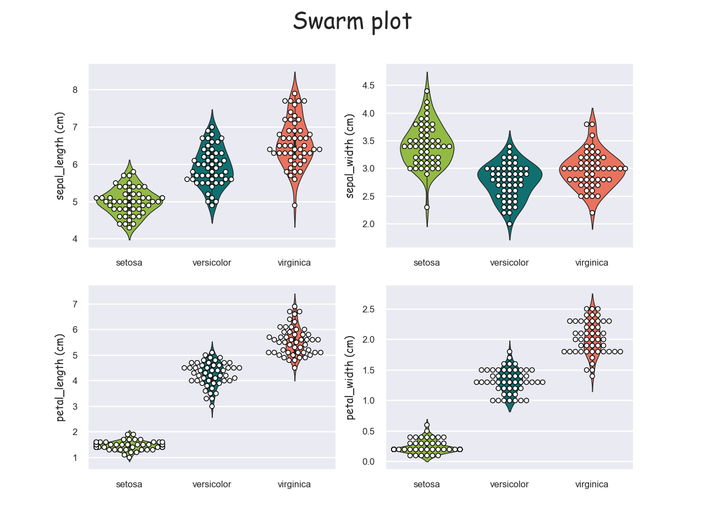

# pands-project2021
Fisher’s Iris data set

Problem statement
This project concerns the well-known Fisher’s Iris data set [3]. You must research the data set
and write documentation and code (in Python [1]) to investigate it. An online search for
information on the data set will convince you that many people have investigated it
previously. You are expected to be able to break this project into several smaller tasks that
are easier to solve, and to plug these together after they have been completed.
You might do that for this project as follows:
1. Research the data set online and write a summary about it in your README.
2. Download the data set and add it to your repository.
3. Write a program called analysis.py that:
• outputs a summary of each variable to a single text file,
• saves a histogram of each variable to png files, and
• outputs a scatter plot of each pair of variables. 

## Intro
Fisher's Iris data set is a multivarate dataset introduced by statistician Ronald Fisher in his 1936 paper *The use of multiple measurements in taxonuic problems*. It was collected by botanist Edgar Anderson, whom it is also sometimes named after, "to quantify the morphologic variation of Iris flowers of three related species".
The data set consists of 50 samples from each of three species of iris - Iris setosa, Iris virginica and Iris versicolor. Four elements were measured from each - petals and widths of sepals and petals.

Above we can see what exactly what we're referring to.

## part 1 - initial data exploration
### 1.1
First step was to download the dataset which I did from <https://gist.github.com/curran/a08a1080b88344b0c8a7#file-iris-csv> and saved it as a csv (comma ceparated calue) file <<iris_dataset.csv>> in my repositry. I imported the **pandas**, **matplotlib.pyplot**, and **seaborn** libraries to assist in the reading, analysis and visualisation of the data.
- pandas......
- matplotlib.pyplot......
- seaborn .......
Talk a bit about each of these libraries....?

I read the file using pandas with the following instruction:
    iris = pd.read_csv("/Users/caoimhinvallely/Desktop/Programming/Programming2021/pands-project2021/iris_dataset.csv")

### 1.2
I was then able to start some initial parsing of the data. I found the **.size()** and **.shape()** of the data, followed then by the column names (**.colums()**), and then printed out the first and last 5 lines of the data set using the **.head()** and **.tail()** method, plus a random 5 rows using I the **.sample()** method to. We can see that there is 750 entries divided into 150 rows and 5 columns. The colums are titled 'sepal_length', 'sepal_width', 'petal_length', 'petal_width', and 'species'. The printout out of the first 5 rows shows that they are all the same species - 'setosa' - and that all the values are 5.1 and less, with the sepal being considerably bigger than the petal. The last 5 rows are all of the 'virginica' species' and the dimensions are quite different but much less of a difference between sepal and petal size. The random 5 rows printed out show a 3rd species, versicolor, and also display a siginificant range in values in the petal dimensions.

### 1.3
I used the **.describe()** method to delve a bit deeper into the data - this produced a lot of useful information such as the maximum and minimum values, the mean, and the standard deviation. We can quickly see that was suggested above about the petal dimensions is very much the case with a very significant range between the lowest and highest petal length (1.0 - 6.9) and a standard deviation of 1.76.
To dig further we needed to run the same method vut on each variety in isolation. I did this first with **.groupby()** but that produced 32 columns which weren't that easy to read! The following command ran on each species worked better:
    iris.loc[iris['species'] == "setosa"].describe()
The first major thing to jump out is the setosa species has a much lower mean petal length and width than the other 2. The virginica has the highest mean petal length but maybe surprisingly the setosa has the highest mean petal width. The standard deviations are all much lower sugegsting much less variance when each species is taken in isolation.

The results can all be viewed in the outputted textfile <<outputted_iris_data_textfile.txt>>. 

## part 2 - visualisation
### 2.1
Visualising data can make it easier to interpret. I've set a global colour theme and grid style (**.set_style()**) for all of the visualisations to give a bit of consistency.
I spent a lot of time formatting a lot of the stylitic elements including the various font sizes and styles; the legends; marker sizes and styles; linestyles and sizes, etc. This was both to make everything more aesthetically pleasing and also to make the information clearer and easier to interpret and understand.

### 2.2
- boxplots. 
>"A boxplot is a standardized way of displaying the distribution of data based on a five number summary (“minimum”, first quartile (Q1), median, third quartile (Q3), and “maximum”). It can tell you about your outliers and what their values are. It can also tell you if your data is symmetrical, how tightly your data is grouped, and if and how your data is skewed."

Next I tried boxplots. Explanation?
First we have an overall boxplot.

Blah blah blah
We need to isolate the classes. I've created a grid of 4 boxplots using the **.subplots()** method.

Here we can see ...... the setosa species distinct from the others. But can also define better the comparison between other two species in terms of petal dimensions. In this box plot, the horozontal line in the middle of each box represents the median value while the upper and lower limits of the box represent one standard deviation from there ( I think!). The outstretched arms with lines then represent the 25% and 75% quartiles (I think), while the diamonds represent outliers. What does that all mean!!!! :)

### 2.3
- violin plot
>"A violin plot plays a similar role as a box and whisker plot. It shows the distribution of quantitative data across several levels of one (or more) categorical variables such that those distributions can be compared. Unlike a box plot, in which all of the plot components correspond to actual datapoints, the violin plot features a kernel density estimation of the underlying distribution."

We can get some extra understanding of same data here. We can see a split in the petal visualisationg suggesting some separation.
- swarm plot
>"a good complement to a box or violin plot in cases where you want to show all observations along with some representation of the underlying distribution."

These are in effect violin plots with the data points 'scattered' to represent the distribution of values. I've isolated each of the classes out again and we can see the pattern more clearly. The setosa petal again emerges distinct from the other species.

*I like this visualisation as it looks more "flower-like' (or a ray!) and I play the violin! :)*

### 2.4
-histograms
histograms are the most commonly used graph to show frequency distributions. I've created 4 subplots of histograms - one for each variable. 

??????

### 2.5
Up until now the plotting all involved looking at one numeric parameter at a time. This kind of analysis is called **univariate analysis**. By looking at a second variable and the relationship between the two we are extending our analysis into **bivariate analysis**. Scatterplots are the simplest method to explore this.

>"A scatterplot is a graphic representation of points referencing two variables. To create a scatterplot, two variables are observed and plotted on a graph. The resulting display demonstrates the relationship between the variables. The relationship is strongest where the points are clustered closest together."

I've used the seaborn **.PairGrid()** tool to create a **scatterplot matrix** where every combination of variable is plotted against each other. The four diagonal boxes show histograms, a clearer example of which is to follow.

This is another visualisation of the same data this time using KDE (kernal density estimation), which is a technique that uses probability estimation to create a smooth curve. While normally used with histograms, I think it works well here and looks visuyally pleasing and less cluttered than the scatter plots while revealing the same information

Again we can see clearly that the setosa species is quite distinct from the other two in each of the aspects, especially petal dimensions. In terms of sepal dimensions, versicoler and virginica are quite closely aligned but  less so when it comes to petal dimensions where we can see it bit of divergence. However it doesn't quite separate them.

### 2.6
So it looks like we can quite easily separate and identify the setosa species, but the other two aren't as easily defined. We can have a good idea but nothing conclusive.

### Part 3 further!
The next logical step is seeing whether the data we can predict the species of flower just based on the dimensions of sepal and/or petal. This brings us into machine learning which is outside the breadth of this course but a little research introduced me to the following......!

