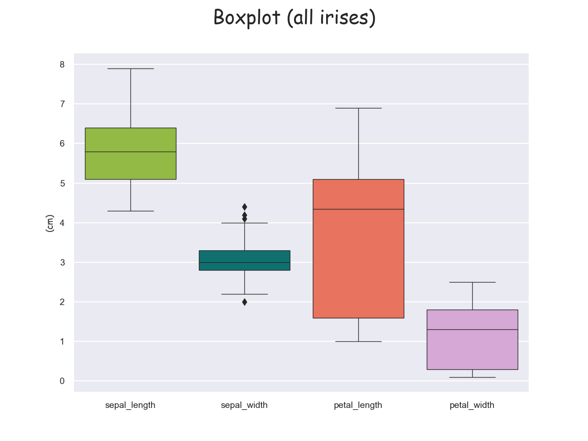
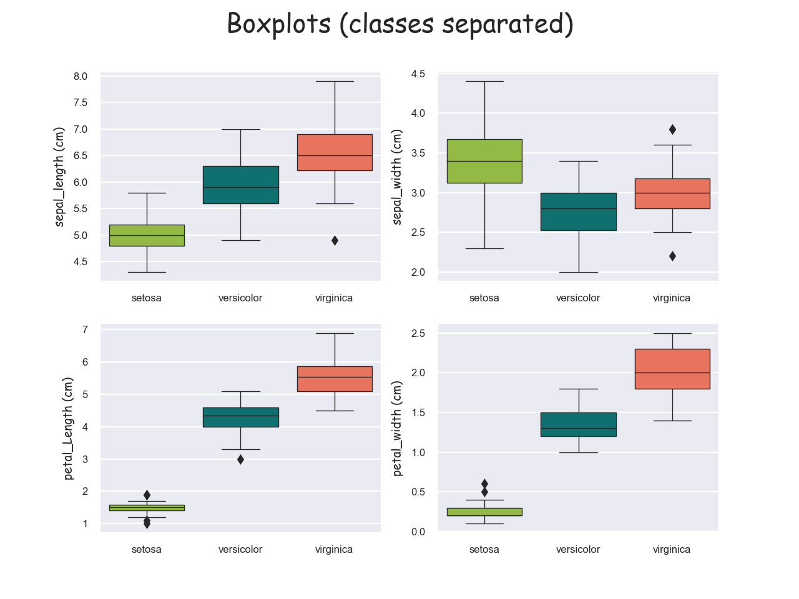
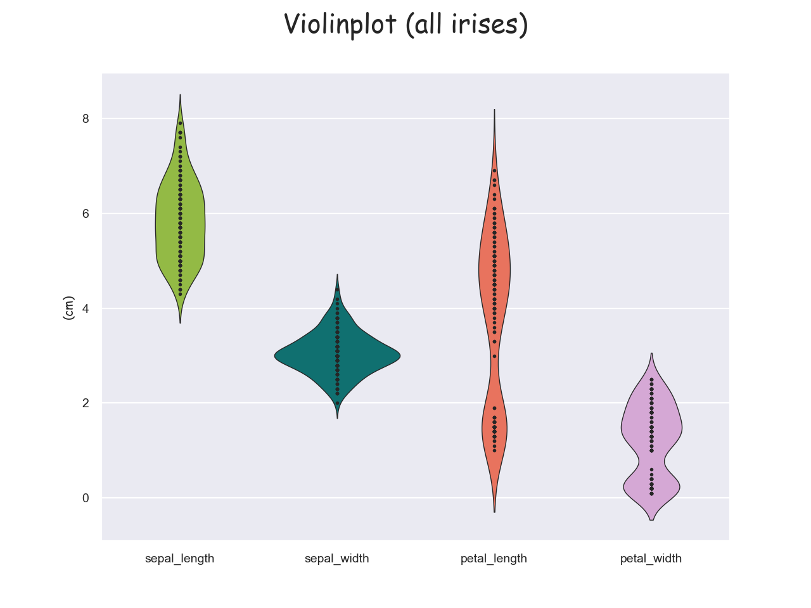
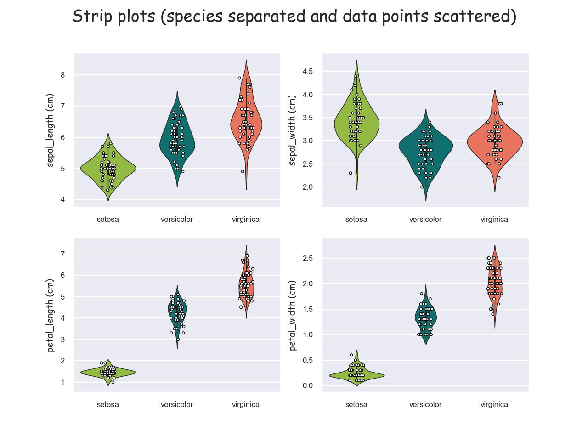
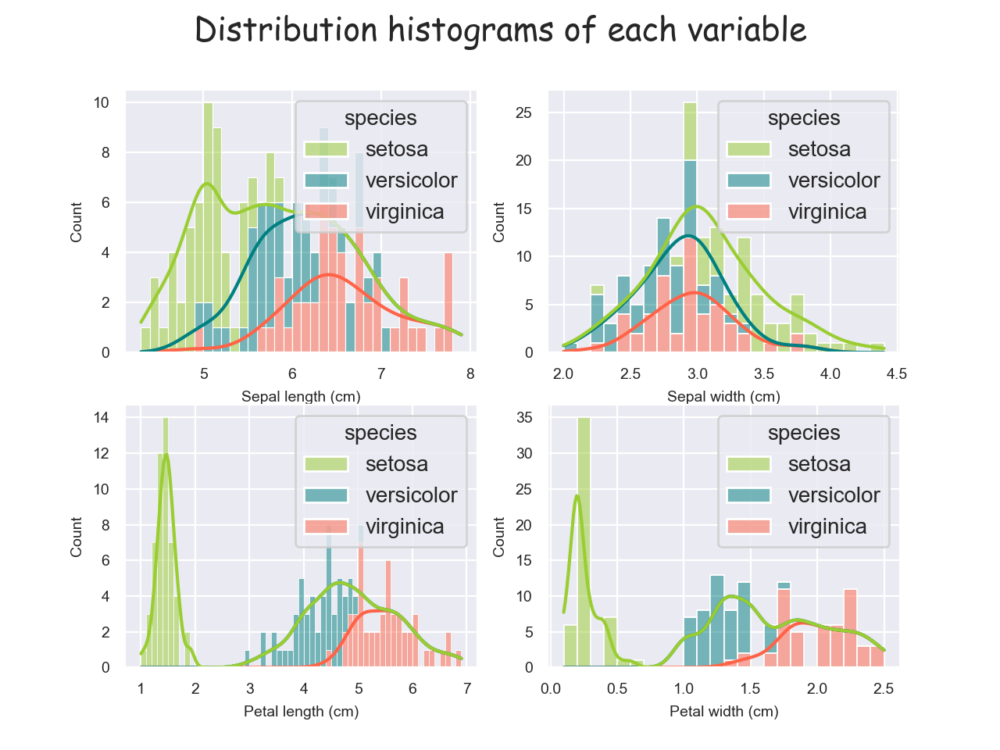
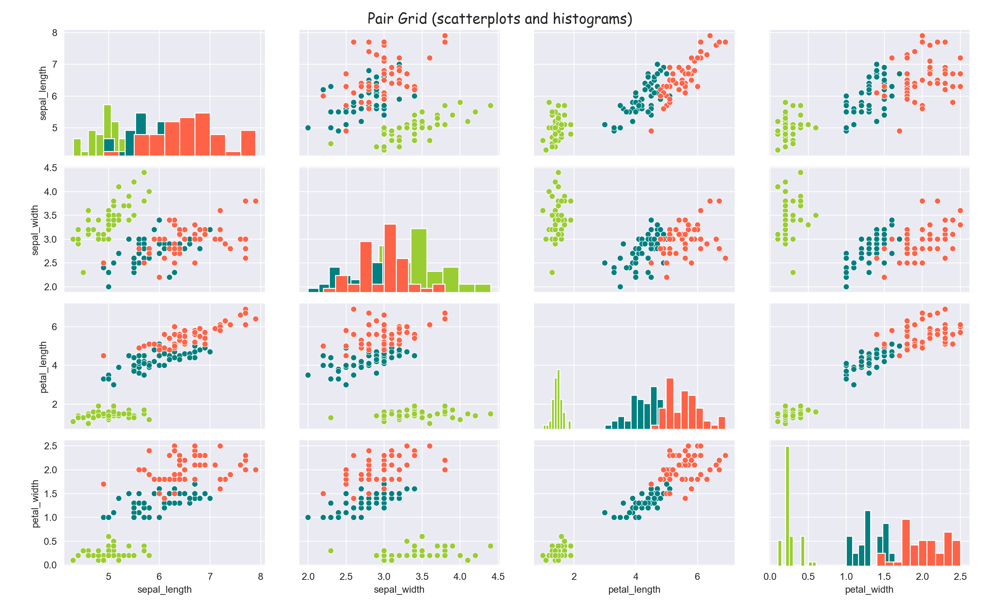
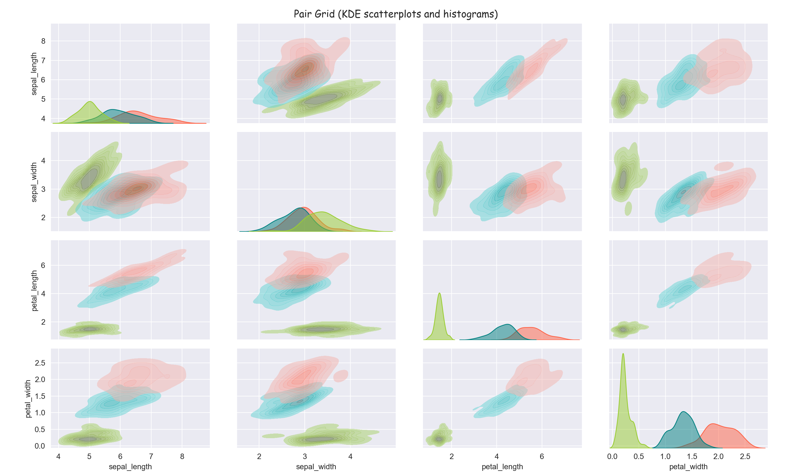

# Fisher’s Iris dataset analysis project  
## Programming and Scripting project 2021  
-----
## Intro  
Fisher's Iris data set is a multivarate dataset introduced by statistician Ronald Fisher in his 1936 paper *The use of multiple measurements in taxonic problems*. The original data was collected by botanist Edgar Anderson, whom it is also sometimes named after, "to quantify the morphologic variation of Iris flowers of three related species".
The data set consists of 50 samples from each of three species of iris - Iris setosa, Iris virginica and Iris versicolor. Four elements were measured from each - petals and widths of sepals and petals.
*Below we can see what exactly what we're referring to.*

## part 1 - initial data exploration
### 1.1
My first step was to download the dataset which I did from <https://gist.github.com/curran/a08a1080b88344b0c8a7#file-iris-csv> and save it as the csv (comma separated value) file <<iris_dataset.csv>> in this repositry. I imported the **pandas**, **matplotlib.pyplot**, and **seaborn** libraries to assist in the reading, analysis and visualisation of the data.
- **pandas** - > "... is a fast, powerful, flexible and easy to use open source data analysis and manipulation tool,
built on top of the Python programming language."
- **matplotlib.pyplot** - > "...is a state-based interface to matplotlib. It provides a MATLAB-like way of plotting. Pyplot is mainly intended for interactive plots and simple cases of programmatic plot generation."
- **seaborn** - > "... is a Python data visualization library based on matplotlib. It provides a high-level interface for drawing attractive and informative statistical graphics."

These are imported as per convention, and economy of space, as **pd**, **plt**, and **sns** respectively.

I read the file using **pandas** with the following:

    iris = pd.read_csv("/Users/caoimhinvallely/Desktop/Programming/Programming2021/pands-project2021/iris_dataset.csv")

### 1.2
*Note: the program writes a summation of all of the following findings to the text file <outputted_iris_data_textfile.txt>, a copy of which is inclued in this repositry.*
I was then able to start some initial parsing of the data. I found the **.size()** and **.shape()** of the data, followed then by the column names (**.columns()**). **.isnull()** tells me their are no missing values in the dataset. I then printed out the first and last 5 lines of the data set using the **.head()** and **.tail()** tools, plus a random/sample 5 rows using the **.sample()** tool. We can see that there are 750 entries divided into 150 rows and 5 columns.
The columns are titled 'sepal_length', 'sepal_width', 'petal_length', 'petal_width', and 'species'. The printout out of the first 5 rows shows that they are all the same species - 'setosa' - and that all the values are 5.1 and less, with the sepal being considerably bigger than the petal. The last 5 rows are all of the 'virginica' species' with the dimensions being quite different but less of a difference between sepal and petal size. The sample 5 rows displayed out show a 3rd species, versicolor, and also display a siginificant range in values in the petal dimensions. **.value_counts()** tells me that the 150 rows are divided evenly between these 3 species.

### 1.3
I used the **.describe()** method to delve a bit deeper into the data. This produced a lot of useful information such as the maximum and minimum values, the mean, and the standard deviation. We can quickly see that what was suggested above about the petal dimensions is very much the case with a very significant range between the lowest and highest petal length (1.0 - 6.9) and a standard deviation of 1.76.
To dig further we needed to apply the same method to each variety in isolation. I did this first with **.groupby()** but that produced 32 columns which weren't that easy to read! The following command ran on each species worked better:

    iris.loc[iris['species'] == "setosa"].describe()

The first major thing to emerge is that the setosa species has a much lower mean petal length and width than the other 2 varieties. The virginica has the highest mean petal length but surprisingly the setosa has the highest mean petal width. The standard deviations are all much lower suggesting much less variance when each species is taken in isolation.

I then decided to add all of the dimensions on each row and create a new column entitled **'totals'**. I also created a column for the **mean** of each row. A version of this new dataset is saved as a csv file entitled **iris_data_sets_with_totals.csv** in the repositry.
I then isolated each species and viewed the **head** of each with the new columns, and then calculated the mean and standard deviation for the **totals** column. I could have used **describe()** again but I'm not sure how much useful extra information that would produce. So we can clearly see a distinction here with the setosa species appearing considerably smaller, with a relatively low standard deviation. The others are a little closer in dimension with a higher SD.

Again all of these results can be viewed in the text file <outputted_iris_data_textfile.txt> in the repositry.

## part 2 - visualisation
### 2.1
Visualising data can make it much easier to interpret and present, so I put a lot of energy into this aspect of the project. The libraries **matplotlib.pyplot** and its relative **seaborn** contain many powerful and highly effective analysis and visualisation tools in this area, so I endeavoured to get the most of them that I could.
I've set a global colour theme and grid style (**.set_style()**) for all of the visualisations to give a bit of consistency. I spent a lot of time formatting a lot of the stylitic elements including the various font sizes and styles; the legends; marker sizes and styles; linestyles and sizes, etc. This was both to make everything more aesthetically pleasing and also to make the information clearer and easier to interpret and understand.

### 2.2
- **box plot**  
>"A boxplot is a standardized way of displaying the distribution of data based on a five number summary (“minimum”, first quartile (Q1), median, third quartile (Q3), and “maximum”). It can tell you about your outliers and what their values are. It can also tell you if your data is symmetrical, how tightly your data is grouped, and if and how your data is skewed."

The box plot seemed to be the best place to start to get an overall impression of the data. We started with an overall boxplot taking in all of the data at once:

We can see all the relative dimensions of each element. The sepal length is the longest dimension while the petal width is the smallest. The petal length has the biggest variance while the sepal width has the least. We can see this information already in the text analysis above but it is much easier to appreciate when presented in this manner.  
To find out more we need to isolate the elements and see what is going on with each individual species. I've created a grid of 4 boxplots here using the **.subplots()** tool.

Here we can see the setosa species emerging as being quite distinct from the others particularly in terms of petal length and width. But we can also define somewhat of a difference between the other two species in terms of petal dimensions.

### 2.3  
- **violin plot**  
>"A violin plot plays a similar role as a box ... plot. It shows the distribution of quantitative data across several levels of one (or more) categorical variables such that those distributions can be compared. Unlike a box plot, in which all of the plot components correspond to actual datapoints, the violin plot features a kernel density estimation of the underlying distribution."

We can get some extra understanding of same data here. We can see a split in the petal visualisationg suggesting some separation.  

- **strip plot**  
>"a good complement to a box or violin plot in cases where you want to show all observations along with some representation of the underlying distribution."

These are in effect violin plots with the data points 'scattered' to represent the distribution of values. I've isolated each of the classes out again and we can see the pattern more clearly. The setosa petal again emerges distinct from the other species when we look at the petal dimensions.

### 2.4  
- **histogram**  
histograms are the most commonly used graph to show frequency distributions. I've created 4 subplots of histograms - one for each variable. 

I've also included a KDE curve which estimated the density between the data points. We can clearly see the same  pattern as above with the setosa petal quite separate to the others.

### 2.5
Up until now all of the plotting has involved looking at one numeric parameter at a time. This kind of analysis is called **univariate analysis**. By looking at a second variable and the relationship between the two we are extending our analysis into **bivariate analysis**. Scatterplots are the simplest and most common method to explore this.
- **scatter plot**
>"A scatterplot is a graphic representation of points referencing two variables. To create a scatterplot, two variables are observed and plotted on a graph. The resulting display demonstrates the relationship between the variables. The relationship is strongest where the points are clustered closest together."

I've used the seaborn **.PairGrid()** tool to create a **scatterplot matrix** where each combination of variable is plotted against each other. The four diagonal boxes show more histograms.

Below is another visualisation of the same data this time using KDE (kernal density estimation), which is a technique that uses probability estimation to create a smooth curve. While normally used with histograms, I think it works well here and looks visually pleasing and less cluttered than the scatter plots while revealing the same information

Again we can see clearly that the setosa species is quite distinct from the other two in each of the variables, especially petal dimensions. In terms of sepal dimensions, versicolar and virginica are quite closely aligned but  less so when it comes to petal dimensions where we can see a bit of divergence. However it doesn't quite separate them.

### 2.6
So it looks like we can quite easily separate and identify the setosa species, but the other two aren't as easily defined. We can have a good idea but nothing conclusive.

### Part 3 further!
The next logical step is seeing whether the data we can predict the species of flower just based on the dimensions of sepal and/or petal. This brings us into machine learning which is outside the breadth of this course but a little research introduced me to the following......!

## References
https://medium.com/@avulurivenkatasaireddy/exploratory-data-analysis-of-iris-data-set-using-python-823e54110d2d
https://www.questionpro.com/blog/quantitative-data/
https://humansofdata.atlan.com/2018/09/qualitative-quantitative-data-analysis-methods/
https://matplotlib.org/3.1.0/api/_as_gen/matplotlib.pyplot.scatter.html
https://matplotlib.org/stable/api/_as_gen/matplotlib.pyplot.scatter.html#matplotlib.pyplot.scatter
https://stackabuse.com/how-to-set-axis-range-xlim-ylim-in-matplotlib/
https://matplotlib.org/stable/gallery/subplots_axes_and_figures/subplot.html#sphx-glr-gallery-subplots-axes-and-figures-subplot-py
https://www.delftstack.com/howto/matplotlib/how-to-set-a-single-main-title-for-all-the-subplots-in-matplotlib/
https://www.geeksforgeeks.org/matplotlib-pyplot-legend-in-python/
https://stackoverflow.com/questions/27016904/matplotlib-legends-in-subplot
https://matplotlib.org/stable/gallery/subplots_axes_and_figures/subplots_demo.html
https://medium.com/@avulurivenkatasaireddy/exploratory-data-analysis-of-iris-data-set-using-python-823e54110d2d
https://realpython.com/python-histograms/#visualizing-histograms-with-matplotlib-and-pandas
https://stackoverflow.com/questions/6390393/matplotlib-make-tick-labels-font-size-smaller
https://matplotlib.org/stable/api/_as_gen/matplotlib.lines.Line2D.html#matplotlib.lines.Line2D.set_linestyle
https://www.marsja.se/pandas-scatter-matrix-pair-plot/
https://www.geeksforgeeks.org/pair-plots-using-scatter-matrix-in-pandas/
https://seaborn.pydata.org/generated/seaborn.pairplot.html
https://seaborn.pydata.org/generated/seaborn.histplot.html
https://stackoverflow.com/questions/41384040/subplot-for-seaborn-boxplot
https://seaborn.pydata.org/tutorial/axis_grids.html
https://seaborn.pydata.org/generated/seaborn.scatterplot.html
https://seaborn.pydata.org/generated/seaborn.scatterplot.html
YouTube video on seaborn - https://www.youtube.com/watch?v=6GUZXDef2U0
https://seaborn.pydata.org/tutorial/color_palettes.html
https://datavizpyr.com/change-edge-color-on-seaborn-scatter-plot/
https://stackoverflow.com/questions/52096050/seaborn-title-position
https://www.w3schools.com/python/ref_file_writelines.asp
https://seaborn.pydata.org/generated/seaborn.kdeplot.html
https://www.geeksforgeeks.org/kde-plot-visualization-with-pandas-and-seaborn/
image for irises - https://morioh.com/p/eafb28ccf4e3
https://matplotlib.org/stable/gallery/color/named_colors.html
https://towardsdatascience.com/understanding-boxplots-5e2df7bcbd51
https://seaborn.pydata.org/generated/seaborn.violinplot.html
https://seaborn.pydata.org/generated/seaborn.swarmplot.html
https://matplotlib.org/stable/api/_as_gen/matplotlib.pyplot.html
https://onlinelibrary.wiley.com/doi/epdf/10.1111/j.1469-1809.1936.tb02137.x
https://www.geeksforgeeks.org/python-basics-of-pandas-using-iris-dataset/
https://towardsdatascience.com/how-to-export-pandas-dataframe-to-csv-2038e43d9c03
https://beginnersbook.com/2019/03/python-set-copy-method/#:~:text=The%20copy()%20method%20in,()%20method%20instead%20of%20%3D%20operator.

