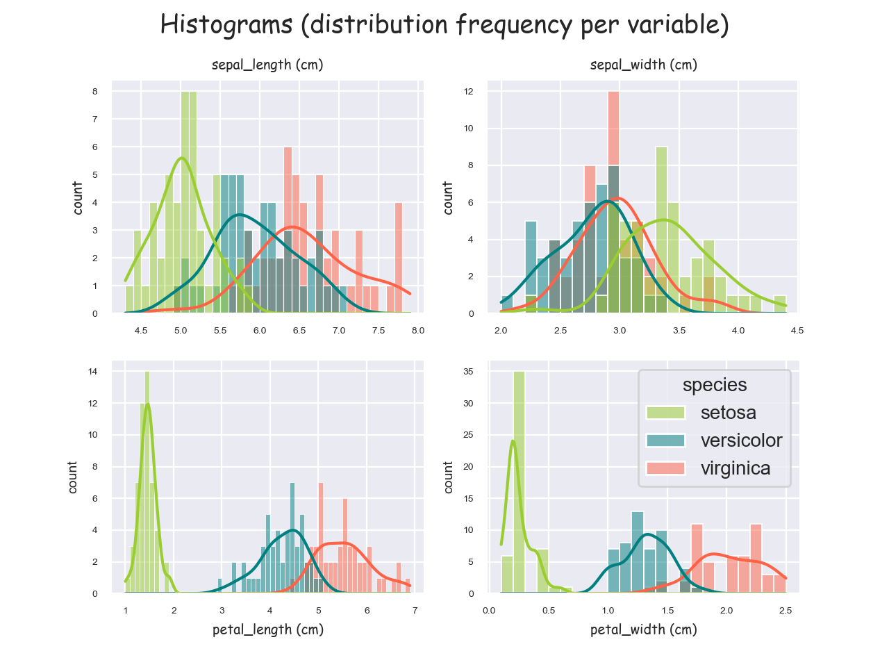

# pands-project2021
Fisher’s Iris data set

Problem statement
This project concerns the well-known Fisher’s Iris data set [3]. You must research the data set
and write documentation and code (in Python [1]) to investigate it. An online search for
information on the data set will convince you that many people have investigated it
previously. You are expected to be able to break this project into several smaller tasks that
are easier to solve, and to plug these together after they have been completed.
You might do that for this project as follows:
1. Research the data set online and write a summary about it in your README.
2. Download the data set and add it to your repository.
3. Write a program called analysis.py that:
• outputs a summary of each variable to a single text file,
• saves a histogram of each variable to png files, and
• outputs a scatter plot of each pair of variables. 

Intro
Fisher's Iris data set is a multivarate dataset introduced by statistician Ronald Fisher in his 1936 paper *The use of multiple measurements in taxonuic problems*. It was collected by botanist Edgar Anderson, whom it is also sometimes named after, "to quantify the morphologic variation of Iris flowers of three related species".
The data set consists of 50 samples from each of three species of iris - Iris setosa, Iris virginica and Iris versicolor. Four elements were measured from each - petals and widths of sepals and petals.

Above we can see what exactly what we're referring to.

## Process - initial number crunching
I downloaded the data as a csv file which can be viewed in the accompanying file <<iris_dataset.csv>>. I imported the **pandas**, **matplotlib.pyplot**, and **seaborn** modules to assist in the reading, analysis and visualisation of the data.
I read the file using the **.read_csv()** method and started some initial parsing of the data. I found the **.size()** and **.shape()** of the data, followed then by the column names (**.colums()**), and then printed out the first 5 lines of the data set using the **.head()** method. I used the **.describe()** method to delve a bit deeper into the data - this produced a lot of useful information such as the maximum and minimun values, the mean, and the standard deviation. I then isolated each species of iris using the **.groupby()** method and did the same analysis. I finished off this initial exploration by looking at correlation (**.corr()**) in the data.
The results can all be viewed in the outputted textfile <<outputted_iris_data_textfile.txt>>. 
## What did I discover??????
We can see straight away.........!

## part 2 visualisation
Visualising data can make it easier to interpret. I'm using the **myplotlib.pyplot** and **seaborn** libraries for this. I've set a global colour theme and grid style (**.set_style()**) for all of the visualisations to give a bit of consistency.
I spent a lot of time formatting a lot of the stylitic elements including the various font sizes and styles; the legends; marker sizes and styles; linestyles and sizes, etc. This was both to make everything more aesthetically pleasing and also to make the information clearer and easier to interpret and understand.

2.1
- boxplots. 

Next I tried boxplots. Explanation?
First we have an overall boxplot.

Blah blah blah
We need to isolate the classes. I've created a grid of 4 boxplots using the **.subplots()** method.

Here we can see ...... the setosa species distinct from the others. But can also define better the comparison between other two species in terms of petal dimensions. In this box plot, the horozontal line in the middle of each box represents the median value while the upper and lower limits of the box represent one standard deviation from there ( I think!). The outstretched arms with lines then represent the 25% and 75% quartiles (I think), while the diamonds represent outliers. What does that all mean!!!! :)

2.2
- violin plot
A violin plot is ........!

We can get some extra understanding of same data here. We can see a split in the petal visualisationg suggesting some separation.
Tghe following plots are swarm plots - violin plots with the data points 'scattered' in place. I've isolated each of the classes out again and we can see the pattern more clearly. The setosa petal is definitely distinct from the other species.

I like this visualisation as it looks more "flower-like' (or a ray!) and I play the violin! :)

2.3
-histograms
histograms are.......!
I created 4 subplots of histograms - one for each element. Again we can see similar patterns as above. findings.

3.1
Up until now the plotting all involved looking at one numeric parameter at a time. This kind of analysis is called **univariate analysis**. By looking at a second variable and the relationship between the two we are extending our analysis to become **bivariate**. Scatterplots are a very simple method to see any relationships etc that may be present.

A scatterplot is a graphic representation of points referencing two variables. To create a scatterplot, two variables are observed and plotted on a graph. The resulting display demonstrates the relationship between the variables. The relationship is strongest where the points are clustered closest together.

I created a matrix scatterplot which plots every combination of variable pair against each other. The four diagonal boxes show stacked histograms, a slight variation on that shown above in fig. x

This is another visualisation of the same data using KDE (kernal density estimation). 

The first thing that jumps out again is that the setosa species is quite distinct from the other two in each of the aspects. In terms of sepal dimensions, versicoler and virginica are quite closely aligned but  less so when it comes to petal dimensions where we can see it bit of divergence. However it doesn't quite separate them.

4.1
The next logical step is seeing whether the data we can predict the species of flower just based on the dimensions of sepal and/or petal. This brings us into machine learning which is outside the breadth of this course but a little research introduced me to the following......!

