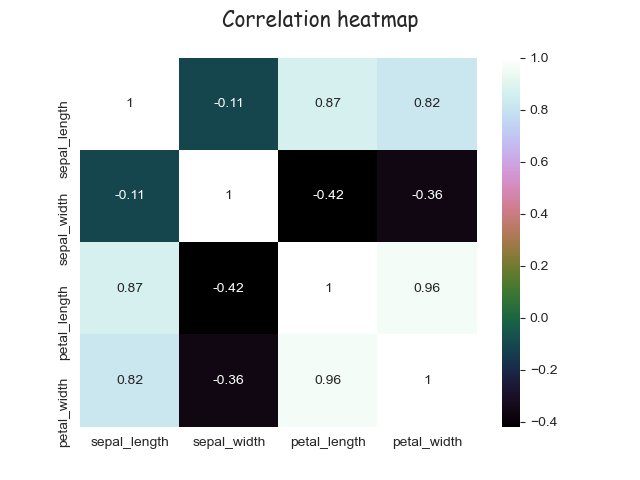
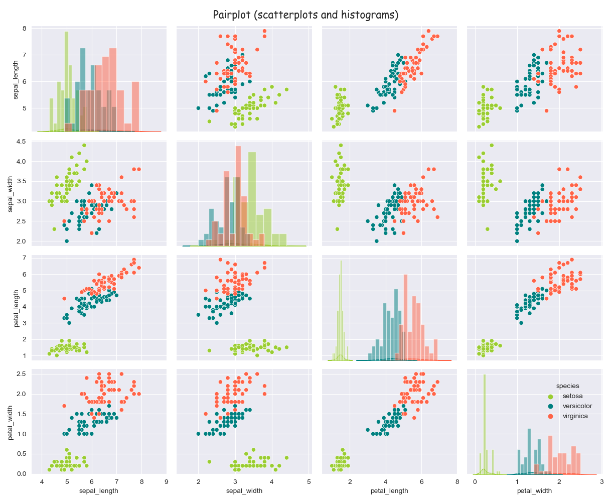
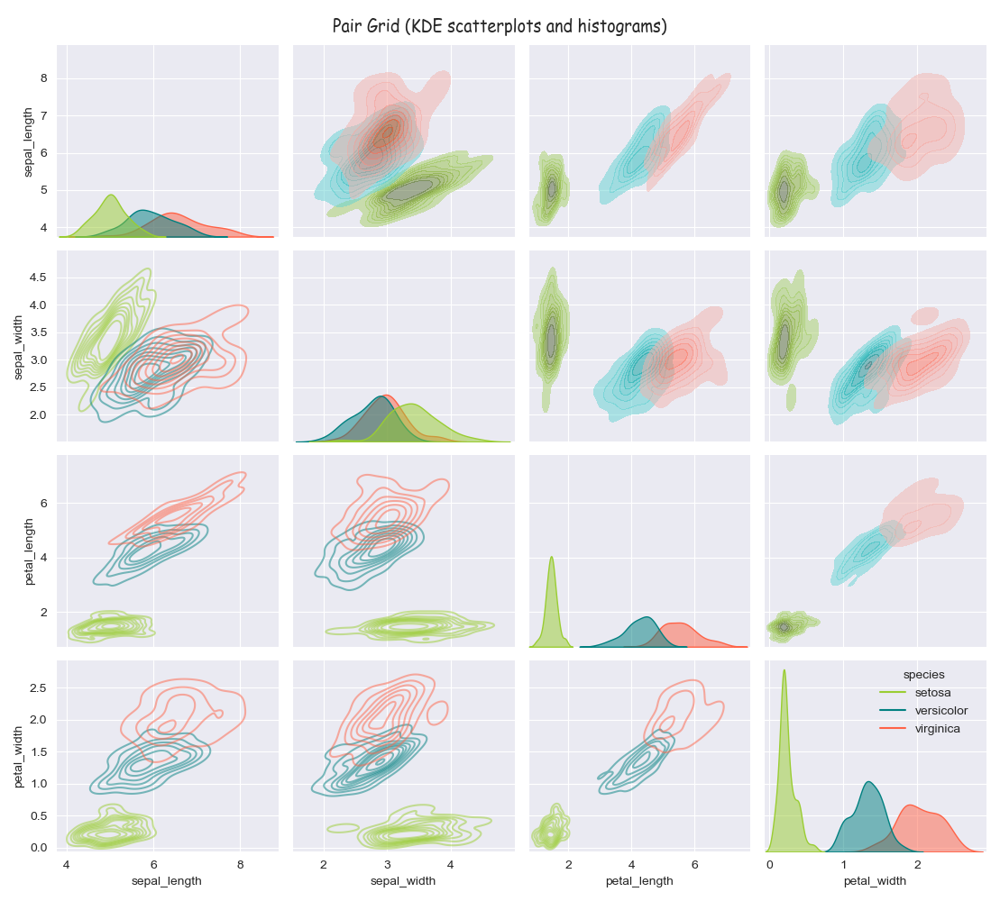

# Fisher’s Iris dataset - Analysis Project  

## **student_name:** Caoimhin Vallely  
## **student_number:** G00398568
## **course:** HDip in Data Analytics, GMIT

### Table of contents
1. [Introduction](#Introduction)
2. [Background](#Background)
3. [Program](#Program)
4. [Guide_to_Repositry](#Guide_to_Repositry)
5. [Initial_data_exploration](#Initial_data_exploration)
    1. [Part1](#Part1)
    2. [Part2](#Part2)
    3. [Part3](#Part3)
    4. [Part4](#Part4)
6. [Visualisation](#Visualisation)
    1. [Heatmap](#Heatmap)
    2. [Parallel_coordinates](#Parallel_coordinates)
    3. [Boxplot](#Boxplot)
    4. [Violinplot](#Violinplot)
    5. [Histogram](#Histogram)
    6. [Scatterplot](#Scatterplot)
    7. [Pairplot](#Pairplot)
7. [Conclusion](#Conclusion)
8. [References](#Refernces)

-----

## Introduction 

>**Taxonomy** - *"... the scientific study of naming, defining and classifying groups of biological organisms based on shared characteristics."* 

Fisher's Iris dataset is a collection of measurements of the attributes of different species of the Iris flower. It was introduced by the statistician Ronald Fisher in a 1936 paper *"The Use of Multiple Measurements in Taxonic Problems*, and has developed into a very popular testcase for students of various mathematic and scientific disciplines. The original data was collected by botanist Edgar Anderson, whom it is also sometimes named after, *"to quantify the morphologic variation of Iris flowers of three related species"*.  

## Background 
The dataset consists of 50 samples from each of three species of iris - Iris setosa, Iris virginica and Iris versicolor. Four attributes were measured from each sample - lengths and widths of both sepals and petals in cemtimetres. The samples from the setosa and versicolar were all collected on the same day from the same field by the same person. The third species was collected elsewhere.

 >**Morphology** - *"... the form and structure of an organism or one of its parts."*  
 
I felt a good place to start was reading Ronald Fisher's original paper. I found this quite a diffcult read, with a lot of statistical terminology and methodology that is beyond my level of understanding at this point. What I did understand was very interesting though, and what impressed me most was that he did all of this without a calculator or computer!

The wikipedia entry on the dataset, along with some more general background information, tells us that the dataset has become an important testcase in many fields. Although the paragragh on uses of the dataset focuses mostly on machine learning which is outside the breadth of this module. We learn that Fisher's original paper was an example of linear disciminant analysis.

>**Linear discriminant analysis** - *"... method used in statistics and other fields, to find a linear combination of features that characterizes or separates two or more classes of objects or events."*  

The article *The Iris Dataset — A Little Bit of History and Biology* by Yong Cui gives a more general overview of the dataset, and to me at least, is a bit more accessible. We get some more background on each of the main protagonists and their further contributions to their respective fields.
It's quite interesting to find out that although Fisher developed this model to discriminate between the species, botanists (including Anderson himself), discovered that seed size was a more reliable differentiator! Anyway, the main takeaway from this article for me, is that appreciating and trying to understand something about the actual data subject matter is important, and one shouldn't just focus on the figures in isolation.

In preparation, I did some revision of basic statistical methods. However, apart from that, I haven't ventured outside the subject matter and methods covered in the lectures to date. There was a temptation to delve into machine learning, which it is suggested this dataset is quite appropriate for, but I resisted, reckoning I'd be better equipped for that further down the line.

## Program 
The program runs from the file **analysis.py** with the modules **plot_functions.py** and **text_analysis.py** imported. I separated the program into 3 files as it was becoming very untidy and hard to manage as the project expanded.
When the program is run, the user is given a short introduction followed by a choice of text analysis or data visualisation. 

    Please choose one of the following options:

		    1) Text analysis
            2) Data visualisations
            3) Exit

From here they are able to navigate between all of the sections of the analysis through a series of **if/elif/else** clauses built inside 2 functions. In the text section, the user can request to view individual elements of analysis, a complete overview, or to save the overview to file. There is also an option to save the amended dataset to file. 

    Choose from the following:

        	1) View the size, shape and column names
        	2) View the 1st and last 5 rows and a random sample of 5 rows
        	3) View a statistical overview of the dataset
        	4) View correlation between variables
        	5) View a statistical overview of each class
        	6) View data on each class with row totals and means
        	7) View means and standard deviation for row totals
        	8) View a complete overview of the data
        	9) Print text analysis to file
        	10) Back to main menu
        	11) Exit

For the visualisations, they are given the choice of viewing each plot or to save each to file. I've included saved versions of the text and all of the plots in the repositry.

    Choose from the following:

        	1) Heatmap
        	2) Parallel Coordinates
        	3) Boxplot ~ all classes
        	4) Boxplots ~ classes separated
        	5) Violinplots ~ all classes
        	6) Stripplots ~ classes separated
        	7) Histograms
        	8) Scatterplot ~ Sepals
        	9) Scatterplot ~ Petals
        	10) Pairplot
        	11) Pairgrid
        	12) Back to main menu
        	13) Quit

## Guide_to_Repositry 
- The **Images** folder contains all of the visualisations created by the program, plus a few other downloaded example images from the web.
- **.gitignore** is an automatically generated text file that tells Git which files or folders to ignore in a project.
- **README.md** you are here!
- **analysis.py** is the main script. Once run the user is presented with a series of menus where they can view (or save to file) all of the text based or visual analyses.
- **iris_dataset.csv** is the original dataset
- **iris_dataset_with_totals.csv** is the dataset with extra columns - row totals, and row means.
- **notes.txt** is a rough journal of my progress through the project.
- **outputted_iris_data_textfile.txt** is the data analysis created by the main program script **analysis.py**
- **plot_functions.py** contains functions that create all of the data visualisations. This is imported into **analysis.py** and the functions are called as required.
- **text_analysis.py** contains all of the text analysis. This is also imported into **analysis.py** and accessed as required from there.

## Initial data exploration 
### Part1 
While this section subsequently migrated to a separate file (**text_analysis.py**) for convenience and tidyness, it originated as the first pieces of code in my main script, so it seems a logical place to start from. My first step was to download the dataset which I did from <https://archive.ics.uci.edu/ml/datasets/Iris and save it as the **csv** file <iris_dataset.csv> and saved it as a **csv** file in this repositry. (I subsequently learned that the dataset was already loaded into the **seaborn** library but by that stage I'd half the project already complete!)
I imported the **pandas** and **csv** libraries to assist in the reading, writing, and analysis of the data for this section.

>**pandas** - "... is a fast, powerful, flexible and easy to use open source data analysis and manipulation tool, built on top of the Python programming language."  

>**csv** - "The csv library provides functionality to both read from and write to CSV files."

Pandas, is imported as per convention, and economy of space, as **pd**.

I read the file using the following code:

    iris = pd.read_csv("/Users/caoimhinvallely/Desktop/Programming/Programming2021/pands-project2021/iris_dataset.csv")

### Part2   
I was then able to start some initial parsing of the data. I found the **.size()** and **.shape()** of the data, followed by the column names (**.columns()**) and object type. **.isnull().values.any()** tells me there are no missing values in the dataset. I then printed out the first and last 6 lines of the data set using the **.head()** and **.tail()** tools, plus a random/sample 6 rows using the **.sample()** tool.   
We can see that there are 750 entries divided into 150 rows and 5 columns. The columns are titled 'sepal_length', 'sepal_width', 'petal_length', 'petal_width', and 'species'. The printout of the first 6 rows shows that they are all the same species - 'setosa' - and that all the values are 5.1cm and less, with the sepal being considerably bigger than the petal. The last 6 rows are all of the 'virginica' species, with the dimensions being quite different but less of a variance between sepal and petal size. The sample 6 rows printed out show a 3rd species, versicolor, and also display a siginificant range in values in the petal dimensions. **.value_counts()** tells me that the 150 rows are divided evenly between these 3 species.

### Part3 
I used the **.describe()** method to delve a bit deeper into the data. This produced a lot of useful information such as the maximum and minimum values, the mean, and the standard deviation. We can quickly see that what was suggested above in relation to the petal dimensions is very much in evidence with quite a significant range between the lowest and highest petal length (1.0cm - 6.9cm) and a standard deviation of 1.76.  

I then looked at correlation in the dataset with the **.corr()** tool. This reveals stong correlation between petal width and length, but considerably less between sepal length and width. Interestingly there is also a strong correlation between sepal length and both petal length and width.  

To dig further we needed to look at each species in isolation. I did this first with **.groupby()** but that produced 32 columns which weren't that easy to read! The following worked better:

    iris.loc[iris['species'] == "setosa"].describe()

The first major point to emerge is that the setosa species has a much lower mean petal length and width than the other 2 varieties. The virginica has the highest mean petal length but surprisingly the setosa has the highest mean petal width. The standard deviations are all much lower suggesting much less variance when each species is taken in isolation.  

### Part4 
Next, I created a **.copy()** of the iris dataset **iris2** so I could perform some further calculations on it without affecting the rest of the subsequent code. I decided to add all of the attributes on each row and create a new column entitled **totals**. I also created a column for the **mean** of each row. I used the following code:

    iris2 = iris.copy()
    cols = iris2.columns
    original_columns = iris2[cols[0:4]]
    iris2["totals"] = original_columns.sum(axis=1)
    iris2["mean"] = original_columns.mean(axis=1)

I reordered the columns with species last, for consistency with the original dataset.  
I then isolated each species and printed the **head** of each with the new columns, and then calculated the mean and standard deviation for the **totals** column. I could have used **describe()** again but I'm not sure how much useful extra information that would produce. We can clearly see a distinction here with the setosa species appearing considerably smaller, with a relatively low standard deviation. The others are a little closer in dimension with a higher SD.

All of the above calculations, along with some formatting, are saved as variables in the file **text_analysis.py**. They are able to view when the main program is run in **analysis.py**. There is also an option here to save an overview of everything to file. An example of the outputted file called **outputted_iris_data_textfile.txt** can be found in the repositry.

## Visualisation 
As with the previous text-based part of the project, the plotting and visualisations also started life in the main script but migrated to their own file later (**plot_functions.py**). I enjoyed this part of the project and maybe got carried away with some of the formatting hence the mountain of code! It seemed to make sense to create functions for each plot, as waiting for all of the plots to **show** each time the program ran became rather cumbersome! The functions are called only when requested through the menu interface so the process is more more economic with the memory.  
We used **matplotlib.pyplot** and **seaborn** for this section, imported as **plt** and **sns** respectively.

>**matplotlib.pyplot** - "...is a state-based interface to matplotlib. It provides a MATLAB-like way of plotting. Pyplot is mainly intended for interactive plots and simple cases of programmatic plot generation."
>**seaborn** - "... is a Python data visualization library based on matplotlib. It provides a high-level interface for drawing attractive and informative statistical graphics."

The visualising of data makes it much easier to interpret and present. The libraries **matplotlib.pyplot**, and its relative **seaborn**, contain many powerful and highly effective analysis and visualisation tools, so I endeavoured to get the most of them that I could.
I've set a global colour theme and grid style (**.set_style()**) for all of the visualisations to give a bit of consistency. I spent a lot of time formatting a lot of the stylitic elements including the various font sizes and styles; the legends; marker sizes and styles; linestyles and sizes, etc. This was both to make everything more aesthetically pleasing and also to make the information clearer and easier to interpret and understand.  
All of the plots are created in functions for ease of recalling in the second part of this program. There is also an option in each function to save the plot to file - examples are already saved to the folder **Images** in this repositry.  

### Heatmap   

>*"**heatmap** is a data visualization technique that shows magnitude of a phenomenon as color in two dimensions."*

We begin by creating a heatmap based on the correlation we investigated above. We save **iris.corr()** as the variable **iris_hm** and then create the heatmap with seaborn **sns.heatmap()**. **annot=True** prints the values on each square, while **cmap="cubehelix"** is the colour palette used. Unfortunately my own colour themes weren't really that effective here so I went with one of the defaults.  

  

The findings are very clear when presented like this with the darker areas representing the least correlation and vice versa. So the petal measurements are highly correlated with each other while the sepal measurements aren't. And as we discovered above there is also high correlation between sepal length and both petal attributes.

### Parallel_coordinates  

Parallel coordinates are an interesting way to view the data. Each row of the dataset is represented by a line on the plot. With the classes separated by colour, we can see that the petal measurements, and in particular petal_length, are better at separating species.  

   

### Boxplot   

>*"A **boxplot** is a standardized way of displaying the distribution of data based on a five number summary (“minimum”, first quartile (Q1), median, third quartile (Q3), and “maximum”). It can tell you about your outliers and what their values are. It can also tell you if your data is symmetrical, how tightly your data is grouped, and if and how your data is skewed."*

The boxplot seemed to be the best place to start to get an overall impression of the data. We started with an overall boxplot taking in all of the data at once.

I created this boxplot with seaborn **sns.boxplot()**. I formatted the **linewidth** and **fliersize** (diamonds representing outliers), and set the colour palette to my customised **color_theme2** (required 4 colours as opposed to 3). I formatted the **ticks_params** a little (**axis='both', which='major', labelsize=7**), and the **ylabel** - **"(cm)", fontsize=7, fontname='fantasy'**. I'm using the **fantasy** font and trying to use the same fontsizes globally for each element for consistency. The xlabel didn't need anything more than the class names which are there by default.

We can see here clearly all the relative dimensions of each element. Sepal_length has the greatest individual value, and highest median value, while petal_width has the smallest individual value and lowest median. Petal_length has the greatest dispersion while the sepal width has the least. We saw this information already in the text analysis above but it is much easier to appreciate when presented in this manner. A normal distribution would be where all 4 quartiles are relatively even. We can see here that sepal_length is the closest in that regard, while both petal dimensions are quite skewed. Sepal_width contains quite a few outliers.

To find out more we need to isolate the attributes and see what is happening within each individual class. 

I've created a grid here of 4 boxplots here using the **plt.subplots()** tool. **(2,2)** defines 2 rows and 2 columns. Within the code for each boxplot I've defined the position, e.g. **ax=axes[0,1]** where the first digit is the row and the second the column (with the 0 being the first row and 1 being the 2nd column). I've formatted all of the same elements as above trying to maintain consistency in the style.

Here we can see the setosa species emerging as being quite distinct from the others particularly in terms of petal length and width. But we can also define somewhat of a difference between the other two species in terms of petal dimensions.

### Violinplot    

>*"A **violin plot** plays a similar role as a box ... plot. It shows the distribution of quantitative data across several levels of one (or more) categorical variables such that those distributions can be compared. Unlike a box plot, in which all of the plot components correspond to actual datapoints, the violin plot features a kernel density estimation of the underlying distribution."*

This violinplot is created using seaborn **sns.violinplot()**. The formatting is nearly the same as the boxplot except an extra element **inner='point'** is defined - this refers to the data points inside the plot.

We can get some extra understanding of same data here. We can see a split in the petal visualisation suggesting some discrimination between the classes.  

>*"A **stripplot** is a good complement to a box or violin plot in cases where you want to show all observations along with some representation of the underlying distribution."*

These are in effect violin plots with the data points 'scattered' to represent the distribution of values. I've isolated each of the classes out again and we can see the pattern more clearly. The setosa petal again emerges distinct from the other species when we look at the petal dimensions.

We created these by first defining the grid as we did with the boxplots **plt.subplots**, then the violin plot as above **sns.violinplot**, and then **sns.stripplot**. The extra formatting for the stripplot concerns the data points - **size=2, color='white', edgecolor='black', linewidth=.5**. A bit of time was spent experimenting with the right combination for each of these to maximise legibility. This actually started out as a **swarmplot**, which adjusts the locations of the data points to avoid overlap, but this was proving problematic with the code. **VSCode** was suggesting making the data points smaller and smaller until it got to the point they were becoming irrelevent! Stripplot while not as pretty and symmetrical behaved better in this regard.

### Histogram   

>*"A **histogram** is a graphical display of data using bars of different heights. In a histogram, each bar groups numbers into ranges. Taller bars show that more data falls in that range.*

These are the most commonly used graph to show frequency distributions. I've again created 4 subplots of histograms - one for each variable/attribute. 

A few extra elements were involved in the formatting here:

    sns.histplot(data=iris, x='sepal_length', binwidth=0.1, hue='species', kde=True, palette=color_theme1, alpha=0.5, legend=False, ax=axes[0,0]

**binwidth=0.1** refers to the value parameters of each 'bar'. I experimeted increasing and decreasing this but this seemed to fir best.
**hue='species'** this separates the classes so we can see them all clearly side by side
**kde=True** kde is kernal density estimation. It draws a continuous curved line which estimates the values between the data points
**alpha=0.5** this allows some blended of the data so that one doesn't overlap the other
**legend=False** as the legend is the same for all I've only included it on one.
We've already seem **palette** and **ax** before.

From these histograms, we can clearly see the same pattern as above with the setosa petal quite separate to the others. The KDE also shows the relative relationships to normal distribution, the most notable aspect of which is the narrowness, and proxomity to the mean, of the petal attributes of the setosa species.

### Scatterplot 

>**Multivariate statistics** - *"... a subdivision of statistics encompassing the simultaneous observation and analysis of more than one outcome variable."*  

Up until now all of the plotting has involved looking at one numeric parameter at a time. This kind of analysis is called **univariate analysis**. By looking at a second variable and the relationship between the two we are extending our analysis into **bivariate or multivariate analysis**. Scatterplots are the simplest and most common method to explore this.  

>*"A **scatterplot** is a graphic representation of points referencing two variables. To create a scatterplot, two variables are observed and plotted on a graph. The resulting display demonstrates the relationship between the variables. The relationship is strongest where the points are clustered closest together."*

The two scatterplots above explore the relationship between the sepal attributes and the petal attributes of each of the classes. Again we can see a separation with the setosa class in both cases, and some separation between versicolor and virginica when it comes to petal attributes. 

### Pairplot 

We can also explore all of the other possible combinations of variables using the very useful seaborn tool **.pairplot()**. This creates a **scatterplot matrix** which, as well as comparing all of the different combinations of variables and their inverse, also produces four histograms on the diagonal.

Below is another visualisation of the same data this time using **KDE** (kernal density estimation) and **.pairgrid()**. KDE is a technique that uses probability estimation to create a smooth curve. While normally used with histograms, I think it works well here and looks visually pleasing and less cluttered than the scatter plots while revealing the same information. Pairgrid gives some extra flexibility over pairplot as I can use different visualisations in different sections, so we can see the set of scatterplots above the diagonal are shaded and those below aren't. 

Again we can see clearly that the setosa species is quite distinct from the other two in each of the variables, especially petal dimensions. In terms of sepal dimensions, versicolar and virginica are quite closely aligned, but less so when it comes to petal dimensions where we can see a bit of divergence. However it doesn't quite separate them.  

## Conclusion 
Most of the literature I read when embarking on this project suggested that only one species, setosa, could be separated linearly. This was quite clearly borne out through all of my analysis. There does appear to be another method that can discriminate between the other two species - **nonlinear principal component analysis** - though the scary wikipedia entry convinces me to leave that to another day :confused:!  
A further progression on this project would be to create an algorithim to test whether we could predict the species just from the attributes. This brings us into the whole area of machine learning. The library **scikit-learn** seems to be very appropriate for this purpose, and indeed has the dataset already loaded.

## References 

### Background
- Fisher, R.A. 1936, *The Use of Multiple Measurements in Taxonomic Problems*, 'Annals of Eugenics, 7: 179-188 (1936)', <https://onlinelibrary.wiley.com/doi/epdf/10.1111/j.1469-1809.1936.tb02137.x>
- *Iris Data Set*, <https://archive.ics.uci.edu/ml/datasets/Iris>
- *Iris flower data set*, <https://en.wikipedia.org/wiki/Iris_flower_data_set>
- Cui, Yong 2020, *The Iris Dataset — A Little Bit of History and Biology*, <https://towardsdatascience.com/the-iris-dataset-a-little-bit-of-history-and-biology-fb4812f5a7b5>
- *Taxonomy (biology)*, <https://en.wikipedia.org/wiki/Taxonomy_(biology)>
- *Linear Discriminant Analysis*, <https://en.wikipedia.org/wiki/Linear_discriminant_analysis>

### Markdown
- *Basic Syntax*, <https://www.markdownguide.org/basic-syntax/>
- *How do I display local image in markdown?*, <https://stackoverflow.com/questions/41604263/how-do-i-display-local-image-in-markdown>
- *Markdown to create pages and table of contents?*, <https://stackoverflow.com/questions/11948245/markdown-to-create-pages-and-table-of-contents>

### Initial data exploration
- *Statistics Basics*, <https://www.statisticshowto.com/statistics-basics/>
- *Quantitative Data: Definition, Types, Analysis and Examples*, <https://www.questionpro.com/blog/quantitative-data/>
- Bhatia, Manu 2018, *Your Guide to Qualitative and Quantitative Data Analysis Methods*, <https://humansofdata.atlan.com/2018/09/qualitative-quantitative-data-analysis-methods/>
- Avuluri, Venkata Sai Reddy 2019, *Exploratory Data Analysis of IRIS Data Set Using Python*, <https://medium.com/@avulurivenkatasaireddy/exploratory-data-analysis-of-iris-data-set-using-python-823e54110d2d>
- Fincher, Jon n.d., *Reading and Writing CSV Files in Python*, <https://realpython.com/python-csv/>
- *Python File writelines() Method*, <https://www.w3schools.com/python/ref_file_writelines.asp>
- *Python – Basics of Pandas using Iris Dataset*, <https://www.geeksforgeeks.org/python-basics-of-pandas-using-iris-dataset/>
- H., Barney 2020, *How to Export Pandas DataFrame to CSV*, <https://towardsdatascience.com/how-to-export-pandas-dataframe-to-csv-2038e43d9c03>
- Singh, Chaitanya n.d., *Python Set copy() Method with examples*, <https://beginnersbook.com/2019/03/python-set-copy-method/#:~:text=The%20copy()%20method%20in,()%20method%20instead%20of%20%3D%20operator.>
- *DOC: floating point precision on writing/reading to csv*, <https://github.com/pandas-dev/pandas/issues/13159>
- Sporer, Zena 2020, *Iris Species Classification — Machine Learning Model*, <https://morioh.com/p/eafb28ccf4e3>

### Data visualisation

#### pandas/matplotlib.pyplot
- *matplotlib.pyplot*, <https://matplotlib.org/stable/api/_as_gen/matplotlib.pyplot.html>
- *matplotlib.pyplot.scatter*, <https://matplotlib.org/3.1.0/api/_as_gen/matplotlib.pyplot.scatter.html>
- *Multiple subplots*, <https://matplotlib.org/stable/gallery/subplots_axes_and_figures/subplot.html#sphx-glr-gallery-subplots-axes-and-figures-subplot-py>
- *Creating multiple subplots using plt.subplots*, <https://matplotlib.org/stable/gallery/subplots_axes_and_figures/subplots_demo.html>
- *List of named colors*, <https://matplotlib.org/stable/gallery/color/named_colors.html>
- *pandas.plotting.parallel_coordinates*, <https://pandas.pydata.org/docs/reference/api/pandas.plotting.parallel_coordinates.html>
- Landup, David n.d., *How to Set Axis Range (xlim, ylim) in Matplotlib*, <https://stackabuse.com/how-to-set-axis-range-xlim-ylim-in-matplotlib/>
- *Set a Single Main Title for All the Subplots in Matplotlib*, <https://www.delftstack.com/howto/matplotlib/how-to-set-a-single-main-title-for-all-the-subplots-in-matplotlib/>
- *Matplotlib.pyplot.legend() in Python*, <https://www.geeksforgeeks.org/matplotlib-pyplot-legend-in-python/>
- *Matplotlib legends in subplot*, <https://stackoverflow.com/questions/27016904/matplotlib-legends-in-subplot>
- Solomon, Brad n.d., *Python Histogram Plotting: NumPy, Matplotlib, Pandas & Seaborn*, <https://realpython.com/python-histograms/#visualizing-histograms-with-matplotlib-and-pandas>
- *Matplotlib make tick labels font size smaller*, <https://stackoverflow.com/questions/6390393/matplotlib-make-tick-labels-font-size-smaller>
- *matplotlib.lines.Line2D*, <https://matplotlib.org/stable/api/_as_gen/matplotlib.lines.Line2D.html#matplotlib.lines.Line2D.set_linestyle>
- Marsaja, Erik 2020, *How to use Pandas Scatter Matrix (Pair Plot) to Visualize Trends in Data*, <https://www.marsja.se/pandas-scatter-matrix-pair-plot/>
- *Pair plots using Scatter matrix in Pandas*, <https://www.geeksforgeeks.org/pair-plots-using-scatter-matrix-in-pandas/>
- Galarnyk, Michael 2018, *Understanding Boxplots*, <https://towardsdatascience.com/understanding-boxplots-5e2df7bcbd51>
- McLeod, Saul 2019, *What does a box plot tell you?*, <https://www.simplypsychology.org/boxplots.html#:~:text=Box%20plots%20are%20useful%20as%20they%20show%20the%20skewness%20of,then%20the%20distribution%20is%20symmetric.>
- Welch, AJ n.d., *How to Save a Plot to a File Using Matplotlib*, <https://chartio.com/resources/tutorials/how-to-save-a-plot-to-a-file-using-matplotlib/>

#### Seaborn
- Banas, Derek 2020, *Seaborn Tutorial 2020*, <https://www.youtube.com/watch?v=6GUZXDef2U0>
- *seaborn.pairplot*, <https://seaborn.pydata.org/generated/seaborn.pairplot.html>
- *seaborn.histplot*, <https://seaborn.pydata.org/generated/seaborn.histplot.html>
- *seaborn.scatterplot*, <https://seaborn.pydata.org/generated/seaborn.scatterplot.html>
- *seaborn.kdeplot*, <https://seaborn.pydata.org/generated/seaborn.kdeplot.html>
- *seaborn.violinplot*, <https://seaborn.pydata.org/generated/seaborn.violinplot.html>
- *seaborn.swarmplot*, <https://seaborn.pydata.org/generated/seaborn.swarmplot.html>
- *Building structured multi-plot grids*, <https://seaborn.pydata.org/tutorial/axis_grids.html>
- *Choosing color palettes*, <https://seaborn.pydata.org/tutorial/color_palettes.html>
- *Subplot for seaborn boxplot*, <https://stackoverflow.com/questions/41384040/subplot-for-seaborn-boxplot>
- *How To Change Edge Color on Seaborn Scatter Plot*, <https://datavizpyr.com/change-edge-color-on-seaborn-scatter-plot/>
- *Seaborn Title Position*, <https://stackoverflow.com/questions/52096050/seaborn-title-position>
- Prateek, Saurav 2019, *KDE Plot Visualization with Pandas and Seaborn*, <https://www.geeksforgeeks.org/kde-plot-visualization-with-pandas-and-seaborn/>
- Ebner, Joshua 2019, *How to make A Seaborn Scatter Plot* - <https://www.sharpsightlabs.com/blog/seaborn-scatter-plot/>

#### Miscellaneous
- *Unused Variable warning in Visual Studio Code (Python)*, <https://stackoverflow.com/questions/60531586/unused-variable-warning-in-visual-studio-code-python>

